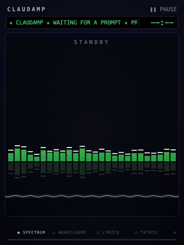
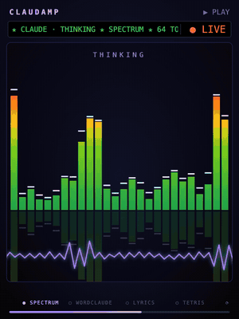
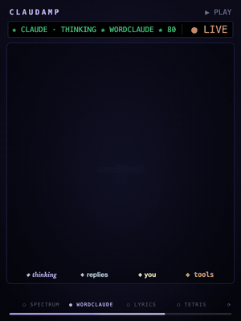
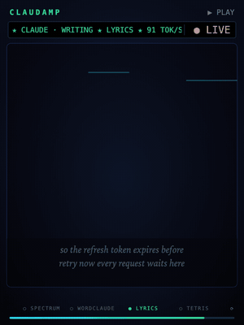
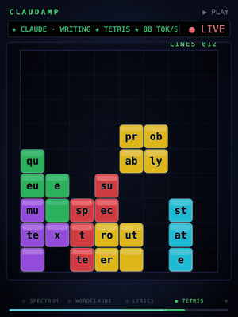
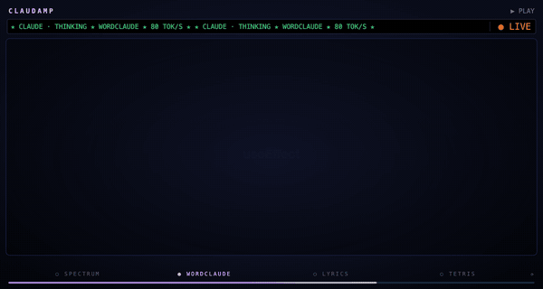

<div align="center">

# ▮▮▮ CLAUDAMP

### Your coding session, now with a visualizer.

A [Claude Code mod](https://code.claude.com/docs/en/plugins/mods/overview) that adds a Winamp-style visualizer sidebar.<br>
It reacts to Claude's thinking, output and tool calls as they stream. When the turn ends, it flashes and shows a summary styled like liner notes.

**[Live demo ↗](https://www.sharshi.com/claudeamp/)** · [Install](#install) · [How it works](#how-it-works)



</div>

---

## Four scenes

A row of buttons at the top of the pane picks the animation. **Your pick is saved** and comes back in every new session. On **⟳ Auto**, the scenes rotate every 12 seconds.

<table>
<tr>
<th>▮▮ Spectrum <kbd>s</kbd></th>
<th>☁ Wordclaude <kbd>c</kbd></th>
<th>♪ Lyrics <kbd>l</kbd></th>
<th>▦ Tetris <kbd>t</kbd></th>
</tr>
<tr>
<td></td>
<td></td>
<td></td>
<td></td>
</tr>
<tr valign="top">
<td>Real data: each bar is a slice of the last few seconds of the stream, as tall as what arrived in it, so bursts and pauses show up as they happen and tool calls land as spikes. Bars are colored by height like the original (green, then yellow, red only at the top), with peak caps and an oscilloscope tracing the same data.</td>
<td>Every word in the session: Claude’s thinking (italic violet), its replies (cyan), your prompts (bold gold) and tool traffic like commands, paths and file contents (amber mono), each sized <b>in direct proportion to its count</b>. The cloud keeps growing, shrinking evenly to fit, and older words fade across turns.</td>
<td>Kinetic type, crossword style: each word snaps onto the last, beside it or turned 90°, while a camera pans, zooms and spins so the newest word always reads level. Older words drift off the board.</td>
<td>Words fall as tetromino pieces. Full rows flash and burst with LINE!, DOUBLE! and TETRIS! callouts. When the stack hits the top it explodes into GAME OVER and INSERT COIN, then a new game starts.</td>
</tr>
</table>

**Colors follow what Claude is doing:**

| | Phase | Look |
| :---: | --- | --- |
| 🟣 | Thinking | Violet aura, slower and moodier motion |
| 🔵 | Writing | Cyan and green, faster bars as text streams |
| 🟠 | Running a tool | Amber; the LCD ticker shows the tool name (`▶ BASH ★ RUNNING ★`) |
| 🔴 | Tool error | A red glitch flash |

## The finale


When the turn ends, the screen flashes white, shockwave rings go out and every bar falls to the floor. Then the **Track complete** card fades in:

- ♪ a song-style **title** for what was done, e.g. *Ballad of the Expired Token*
- ♪ up to three plain-language **summary lines**
- ♪ an LCD **stats strip**: duration, output tokens, tool calls
- ♪ chips for the turn's **top words**

The title and summary come from one small Haiku call over Claude's final reply. If that call fails, the card shows the reply's first sentences instead. The card stays up until your next prompt, or until you click a scene.

<br clear="right">

## Fills any pane

The drawing takes the pane's shape. Wider panes get more bars and a wider Tetris well, taller panes get a bigger Wordclaude, and the finale card stays centered either way. Words also carry over between sessions, so a new session has something to show before your first prompt.



## Install

From a terminal:

```bash
claude plugin marketplace add sharshi/claudeamp
claude plugin install claudamp@claudamp     # choose the user scope
```

User-scope mods also load in the **Claude Code Desktop app's** Code tab, where Claudamp draws its animated SVG version. Start a new session and the pane opens on its own.

<details>
<summary>From a local checkout</summary>

```bash
claude plugin marketplace add /path/to/claudeamp
claude plugin install claudamp@claudamp
```

Claude Code reads a local-folder marketplace straight from the folder, so after editing, run `/reload-plugins` in a session; no reinstall needed. For a quick try without installing, run `claude --plugin-dir /path/to/claudeamp`.

</details>

## Use

| | |
| --- | --- |
| **Buttons** `⟳ Auto` `▮▮ Spectrum` `☁ Wordclaude` `♪ Lyrics` `▦ Tetris` | Pick a scene; your pick is saved |
| **Hotkeys** <kbd>a</kbd> <kbd>s</kbd> <kbd>c</kbd> <kbd>l</kbd> <kbd>t</kbd> | The same, once the pane has focus |
| `/claudamp` | Reopen the pane |
| `/claudamp next` | Next scene (moves the pin if one is set) |
| `/claudamp stats` | How much text the mod has heard from each source (thinking, replies, your prompts, tools) |
| `/claudamp size` | What the pane measured, and the size it draws at |
| `/claudamp mode image` / `frame` | How the Desktop app shows the drawing: `frame` (default) always animates but blinks when it updates; `image` may swap without a blink, so it updates every second |

In the terminal, Claudamp falls back to a simple text version: a `▁▂▃▅▇` bar strip, the current lyric word and the top words.

## How it works

```
turn.step stream ──► thinking / text / tool chunks ──► word tally · lyric buffer · chars/sec
tool.call        ──► tool phase · glitch on error
turn.start       ──► reset · first scene (or your pick)
turn.complete    ──► Haiku liner notes (≤ 4 s) ──► one finale redraw
                         │
clock.every(450ms) ──► $.state (≤ 1 write per 3 s) ──► Pane ──► <Svg> sized to the pane
```

| File | What it does |
| --- | --- |
| `hooks/register.tsx` | The hooks. They watch the token stream without changing it, save the scene pick in `$.store`, and redraw **sparingly** (at most every 3 s, and only for the turn your prompt started): every state write redraws the pane, and the Desktop app reloads an SVG whole, so frequent writes would blink. All motion between redraws comes from the CSS inside the SVG. |
| `hooks/scenes.ts` | Pure functions from state to SVG, laid out against a frame shaped like the pane. Randomized negative animation delays make a redraw look continuous instead of starting over. |
| `hooks/ticker.tsx` | The live LCD strip on Desktop: a `Client` that runs inside the pane, scrolling its marquee and ticking the turn clock on its own, and asking for fresh tok/s, phase and the current tool call about three times a second, so it updates without redrawing the pane. |
| `hooks/words.ts` | Tokenizing, stopwords, and a word tally that slowly forgets older words. |

Tetris is played in full ahead of time: a simple AI drops each word-piece, avoiding holes and keeping the stack low, then gets careless after about 25 seconds so every game ends in a top-out. The whole game, including falls, line clears, gravity and the final explosion, is written out as one CSS timeline. Its clock runs from the turn's start, so a redraw picks the game up where it was. Games are capped to stay under the Desktop app's 131,072-character SVG limit.

## Develop

```bash
claude plugin validate .
claude plugin test .
```

**Re-recording the GIFs:** the GIFs are real renders of `hooks/scenes.ts`. A scripted session is drawn frame by frame in headless Chrome, which advances CSS animation time with `--virtual-time-budget`, and the frames are stitched together with ffmpeg:

```bash
scripts/record/record.sh   # needs Google Chrome, ffmpeg, node, python3
```

**The site:** `docs/` is the GitHub Pages site (Settings → Pages → *Deploy from a branch* → `main` / `/docs`). Its live player runs the mod's own drawing code; rebuild that bundle after changing `scenes.ts`:

```bash
npx esbuild hooks/scenes.ts --bundle --format=iife --global-name=Claudamp --outfile=docs/assets/scenes.js
```

---

<sub>The finale makes one small Haiku call per completed turn (≤ 300 output tokens). Everything else runs locally. Not affiliated with Winamp. The llama is fine.</sub>
